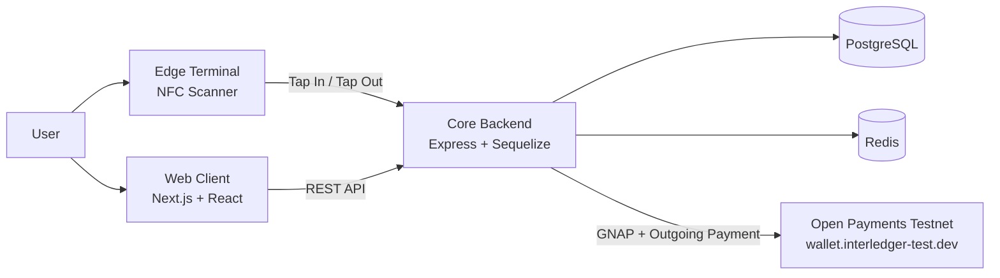
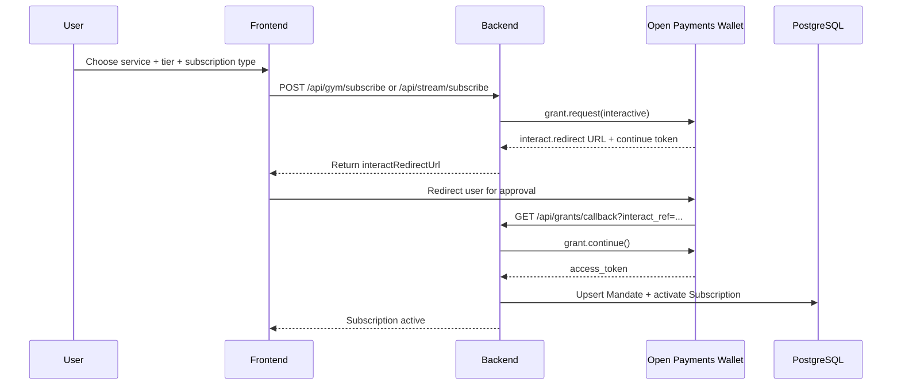
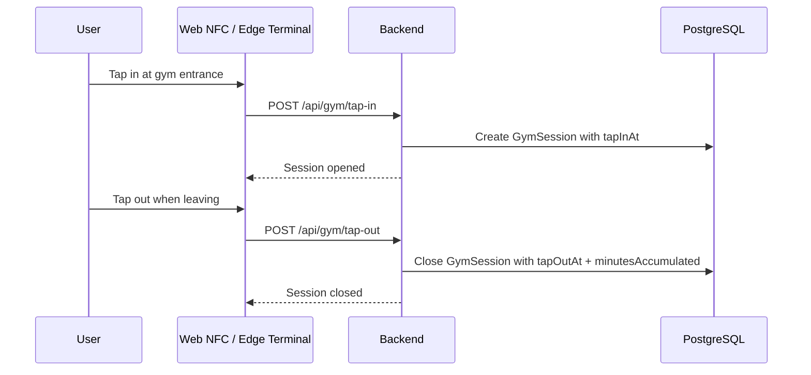
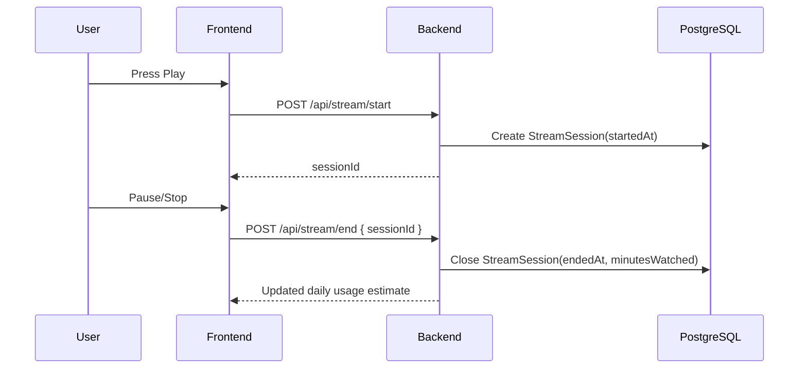
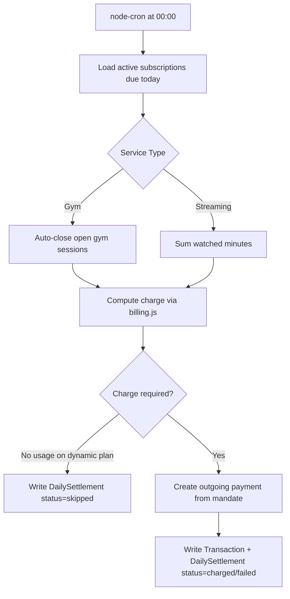

# PavelPayments

PavelPayments is a usage-based billing demo for hackathons, built on Interledger Open Payments.
It shows how to connect wallet authorization (GNAP) with real usage events (gym taps or video watching)
and settle charges automatically.

The project supports two services:

- Gym: billing by visit time with dynamic pricing, plus optional flat subscriptions.
- Streaming: billing by watched minutes.

At midnight, a settlement process calculates daily usage and creates outgoing Open Payments.

---

## Table of Contents

1. [What This Project Does](#what-this-project-does)
2. [System Architecture](#system-architecture)
3. [End-to-End Flows (Charts)](#end-to-end-flows-charts)
4. [Business Logic](#business-logic)
5. [Repository Layout](#repository-layout)
6. [Local Setup (Detailed)](#local-setup-detailed)
7. [Runbook for Teammates](#runbook-for-teammates)
8. [API Reference](#api-reference)
9. [Troubleshooting](#troubleshooting)
10. [Developer Notes](#developer-notes)

---

## What This Project Does

This is a full-stack monorepo where:

- Users connect a testnet wallet.
- The backend obtains a payment grant using GNAP.
- Usage events are recorded (gym sessions or stream sessions).
- A daily settlement job converts usage into charges.
- Outgoing payments are sent through Open Payments.
- Transactions and settlement history are stored for dashboards.

Why this matters for the hackathon:

- Demonstrates pay-as-you-use billing, not a fixed monthly bill.
- Demonstrates machine-friendly payments over open standards.
- Demonstrates one backend supporting multiple usage-based products.

---

## System Architecture

### High-level component map



### Runtime responsibilities

- Web Client:
  - Dashboard pages for gym and streaming.
  - Wallet connect and subscription initiation.
  - Manual testing flows (simulate taps and playback).
- Edge Terminal:
  - NFC entry/exit events pushed to backend.
  - Useful for physical demo setup.
- Core Backend:
  - API endpoints, session tracking, billing calculations, settlement.
  - GNAP grant initialization and callback finalization.
  - Open Payments payment creation.
- PostgreSQL:
  - Persists users, mandates, subscriptions, sessions, settlements, transactions.
- Redis:
  - Supports fast state and cache style needs.

---

## End-to-End Flows (Charts)

### 1. Subscription and wallet authorization flow



### 2. Gym usage flow (tap in and tap out)



### 3. Streaming usage flow (play and stop)



### 4. Midnight settlement flow



---

## Business Logic

### Gym dynamic charge model

Used for pay-as-you-go subscriptions.

Formula:

```text
charge = base_rate - duration_discount + peak_adjustment
```

Parameters:

- base_rate by tier:
  - daily = $6.00
  - weekly = $5.00
  - monthly = $4.00
  - yearly = $3.00
- duration_discount:
  - linear from 0% to 50% as total minutes go from 0 to 120
- peak_adjustment:
  - +$0.50 if more than half of usage is in peak hours
  - -$0.30 otherwise
- peak windows:
  - 06:00-09:00 and 17:00-20:00 local time

If no gym usage is found on a dynamic plan for the day, settlement is marked as skipped and no payment is sent.

### Gym static charge model

Used for flat subscriptions regardless of duration.

| Tier | Flat Charge |
|------|-------------|
| Daily | $6.00 |
| Weekly | $28.00 |
| Monthly | $80.00 |
| Yearly | $800.00 |

For weekly/monthly/yearly static plans, GNAP grant limits include an interval cap so wallet-side enforcement matches the subscription period.

### Streaming charge model

Formula:

```text
charge = totalMinutes * ratePerMinute
```

Rates:

- daily = $0.05/min
- weekly = $0.04/min
- monthly = $0.03/min
- yearly = $0.02/min

---

## Repository Layout

```text
apps/
  core-backend/     Express API + billing + settlement + GNAP/OpenPayments integration
  edge-terminal/    Terminal-side NFC event sender
  web-client/       Next.js dashboards and testing UI
keys/
  private.key       Local private key used for signatures (do not commit)
  public.json       Public JWKS that you upload to wallet testnet
docker-compose.yml  Local Postgres + Redis infrastructure
```

---

## Local Setup (Detailed)

### 1. Prerequisites

- Docker Desktop running.
- Node.js 20+.
- npm installed.
- Testnet wallet account at https://wallet.interledger-test.dev/.

### 2. Generate Ed25519 keys

Run from repository root:

```bash
node -e "
const { generateKeyPairSync } = require('crypto');
const fs = require('fs');
const { privateKey, publicKey } = generateKeyPairSync('ed25519');
fs.writeFileSync('./keys/private.key', privateKey.export({ type:'pkcs8', format:'pem' }));
const jwk = publicKey.export({ format:'jwk' });
fs.writeFileSync('./keys/public.json', JSON.stringify({ keys: [{ ...jwk, kid: 'key-1', alg: 'EdDSA' }] }, null, 2));
console.log('Keys written');
"
```

Upload keys/public.json to the testnet wallet:

1. Open wallet settings.
2. Open Developer Keys.
3. Add key and copy the generated key id.
4. Use this value as KEY_ID in .env.

### 3. Configure environment variables

Create a local env file:

On macOS/Linux:

```bash
cp .env.example .env
```

On PowerShell:

```powershell
Copy-Item .env.example .env
```

Required values:

```env
POSTGRES_HOST=localhost
POSTGRES_PORT=5432
POSTGRES_DB=pavel_payments
POSTGRES_USER=postgres
POSTGRES_PASSWORD=your_password

REDIS_URL=redis://localhost:6379

WALLET_ADDRESS=https://ilp.interledger-test.dev/yourname
KEY_ID=<uuid-from-testnet-wallet>

BACKEND_PUBLIC_URL=http://localhost:4001
FRONTEND_URL=http://localhost:3000

NODE_ENV=development
```

Important:

- BACKEND_PUBLIC_URL must match your backend callback origin.
- KEY_ID must match the key uploaded to wallet testnet.
- Keep keys/private.key local only.

### 4. Start infrastructure (Postgres and Redis)

```bash
docker-compose up -d
```

Check containers:

```bash
docker-compose ps
```

### 5. Install dependencies and start app

```bash
npm install
npm run dev
```

Expected local ports:

- Frontend: http://localhost:3000
- Backend: http://localhost:4001

### 6. Verify everything is healthy

```bash
curl http://localhost:4001/health
curl http://localhost:4001/api/gym/pricing
curl http://localhost:4001/api/stream/pricing
```

---

## Runbook for Teammates

### Demo scenario A: Gym dynamic billing

1. Open frontend at http://localhost:3000.
2. Connect wallet and subscribe to a gym dynamic plan.
3. Simulate tap in and tap out from Gym dashboard or edge terminal.
4. Verify session endpoint:
   - GET /api/gym/session/:uid
5. Trigger settlement manually:

```bash
curl -X POST http://localhost:4001/api/dev/settle-now
```

6. Check history endpoint:
   - GET /api/gym/history/:uid

### Demo scenario B: Streaming billing

1. Subscribe in Streaming dashboard.
2. Start stream (POST /api/stream/start is called).
3. Stop stream (POST /api/stream/end).
4. Check current session summary:
   - GET /api/stream/session/:uid
5. Trigger settlement and review resulting transaction records.

### Daily developer routine

1. Pull latest branch.
2. Ensure Docker is up: docker-compose up -d.
3. Run npm install after dependency changes.
4. Start local app: npm run dev.
5. Run quick API health checks.
6. Validate one gym flow and one streaming flow before merging.

### How to reset local state for clean demos

If you need a fresh DB state for demo runs:

```bash
docker-compose down -v
docker-compose up -d
```

Then re-run app and resubscribe test users.

---

## API Reference

### Gym APIs

| Method | Path | Body / Params | Description |
|--------|------|---------------|-------------|
| POST | /api/gym/tap-in | { uid, terminalId? } | Record gym entry |
| POST | /api/gym/tap-out | { uid, terminalId? } | Record gym exit |
| GET | /api/gym/session/:uid | - | Live session status and estimated charge |
| POST | /api/gym/subscribe | { walletAddress, nfcUid, subscriptionType, tier } | Start GNAP flow and create subscription |
| GET | /api/gym/subscriptions/:uid | - | Active subscriptions |
| GET | /api/gym/pricing | - | Gym pricing constants |
| GET | /api/gym/history/:uid | - | Recent daily settlements |

### Streaming APIs

| Method | Path | Body / Params | Description |
|--------|------|---------------|-------------|
| POST | /api/stream/start | { uid, contentId, contentTitle?, contentType? } | Start stream session |
| POST | /api/stream/end | { sessionId } | End stream session |
| GET | /api/stream/session/:uid | - | Current session + daily usage |
| POST | /api/stream/subscribe | { walletAddress, nfcUid, subscriptionType, tier } | Subscribe for streaming |
| GET | /api/stream/subscriptions/:uid | - | Active subscriptions |
| GET | /api/stream/pricing | - | Streaming pricing constants |

### Grants and Payments APIs

| Method | Path | Description |
|--------|------|-------------|
| POST | /api/grants/initiate | Start wallet authorization flow |
| GET | /api/grants/callback | Complete interactive GNAP callback |
| POST | /api/trigger-payment | Legacy one-shot payment endpoint |
| GET | /api/transactions | Payment history by wallet address |
| GET | /jwks.json | Public JWKS for signature verification |

### Development-only API

| Method | Path | Description |
|--------|------|-------------|
| POST | /api/dev/settle-now | Trigger settlement instantly (skip midnight wait) |

---

## Troubleshooting

### Backend fails to start

- Confirm .env exists and has correct DB and wallet values.
- Confirm keys/private.key and keys/public.json exist.
- Check if port 4001 is already in use.

### Wallet approval succeeds but subscription remains inactive

- Verify BACKEND_PUBLIC_URL is reachable and matches callback URL.
- Verify KEY_ID matches the uploaded developer key.
- Check grant callback logs for interact_ref handling errors.

### Settlement writes skipped unexpectedly

- For dynamic plans, skipped means usage for that day was zero.
- Verify sessions are correctly closed (tap-out or stream-end happened).
- Confirm the test user actually has an active mandate/subscription.

### Docker issues

- Run docker-compose ps and inspect unhealthy/exited containers.
- If state is corrupted, reset:

```bash
docker-compose down -v
docker-compose up -d
```

---

## Developer Notes

### Important backend files

- apps/core-backend/src/services/billing.js
  - All pricing formulas and charge calculations.
- apps/core-backend/src/services/gym-session.js
  - Gym session open/close logic.
- apps/core-backend/src/services/streaming-session.js
  - Streaming session open/close logic.
- apps/core-backend/src/services/settlement.js
  - Daily settlement scheduler and payment orchestration.
- apps/core-backend/src/controllers/grantController.js
  - GNAP callback finalization.

### Open Payments SDK usage pattern

```js
const client = await createAuthenticatedClient({
  walletAddressUrl,
  keyId,
  privateKey: keyConfig.privateKeyBuffer,
});

const wallet = await client.walletAddress.get({ url: walletAddressUrl });

const pendingGrant = await client.grant.request({ url: wallet.authServer }, {
  access_token: { access: [/* outgoing-payment access */] },
  interact: {
    start: ['redirect'],
    finish: { method: 'redirect', uri: callbackUrl, nonce },
  },
});

const finalGrant = await client.grant.continue(
  {
    url: pendingGrant.continue.uri,
    accessToken: pendingGrant.continue.access_token.value,
  },
  { interact_ref },
);

await client.outgoingPayment.create(
  { url: wallet.resourceServer, accessToken: finalGrant.access_token.value },
  {
    walletAddress: wallet.id,
    incomingAmount: { value: '600', assetCode: 'USD', assetScale: 2 },
  },
);
```

### Settlement summary

`runDailySettlement()` executes at 00:00 via node-cron and performs:

1. Load active subscriptions due for billing.
2. Close any open sessions for the day.
3. Aggregate usage minutes.
4. Compute charge via billing engine.
5. Create outgoing payment when charge applies.
6. Persist DailySettlement and Transaction records.

For faster testing, call:

```bash
curl -X POST http://localhost:4001/api/dev/settle-now
```
